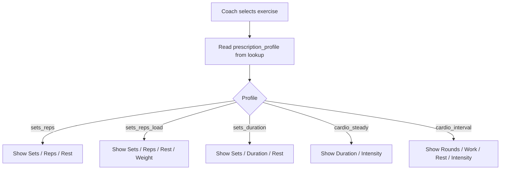

# Admin Frontend — Movement Exercise Prescriptions

Documentation for the **web admin** team implementing care-plan movement tasks with profile-aware exercise prescriptions.

**API base path:** `/v1/web/admin` (authenticated via Sanctum)  
**Shared lookup base path:** `/v1/lookup` (read-only reference data, typically unauthenticated or lightly gated — follow your existing lookup auth pattern)

All endpoints return the standard API envelope:

```json
{
  "status": "success",
  "message": "...",
  "data": { },
  "meta": { "version": "v1" }
}
```

Validation failures return HTTP `422` with `errors` keyed by field path (e.g. `items.0.exercises.1.reps`).

---

## 1. Problem this solves

Previously, every movement exercise under a care-plan task only supported:

- `sets`
- `reps`
- `rest_seconds`

That model breaks for:

| Exercise type | Example | What coaches actually prescribe |
|---|---|---|
| Timed holds | Plank, Side Plank | 3 × 60s hold, 30s rest |
| Steady cardio | Treadmill Walk | 30 min, Moderate intensity |
| HIIT | Sprint Intervals | 8 rounds × 30s work, 60s rest |
| Loaded strength | Barbell Squat | 4 × 8 @ 60 kg |

The backend now uses a **prescription profile** on each library exercise to drive which fields are valid, plus expanded prescription columns on each care-plan exercise row.

---

## 2. Core concepts

### 2.1 Two layers

| Layer | Where stored | Purpose |
|---|---|---|
| **Prescription profile** | `movement_exercises.prescription_profile` | Defines *which fields* the UI should show and which combinations the API accepts |
| **Prescription values** | `care_plan_day_movement_exercises` | The coach’s actual numbers for a specific care-plan task |

### 2.2 Prescription profiles (enum)

| Value | Label | Fields coaches use |
|---|---|---|
| `sets_reps` | Sets & reps | `sets`, `reps`, `rest_seconds` |
| `sets_reps_load` | Sets, reps & load | `sets`, `reps`, `rest_seconds`, `equipment_weight` (+ unit) |
| `sets_duration` | Sets & duration | `sets`, `duration_seconds`, `rest_seconds` |
| `cardio_steady` | Steady-state cardio | `duration_seconds`, `intensity` (optional) |
| `cardio_interval` | Interval cardio | `sets` (rounds), `duration_seconds` (work), `rest_seconds`, `intensity` (optional) |

### 2.3 Intensity levels (enum, optional for cardio)

| Value | Label | Reference range (display only) |
|---|---|---|
| `very_light` | Very light | 50–60%, 110–132 bpm |
| `light` | Light | 60–70%, 132–154 bpm |
| `moderate` | Moderate | 70–80%, 154–176 bpm |
| `hard` | Hard | 80–90%, 176–198 bpm |
| `maximum` | Maximum | 90–100%, 198–220 bpm |

Intensity is **guidance only** — it is not required for cardio profiles.

### 2.4 Equipment weight vs equipment catalog

Do not confuse these:

- **`movement_exercise.equipments`** — what gear the exercise uses (Barbell, Kettlebell, Resistance Band). This is catalog metadata.
- **`equipment_weight`** on the prescription — how much load to use (e.g. `60` kg). Optional even for `sets_reps_load` (coach may prescribe RPE/bodyweight and leave weight empty).
- **Bands** — no separate “light / medium / heavy” enum. Leave `equipment_weight` null and use the task `guidance` text for band tension notes.

### 2.5 HIIT field mapping

For `cardio_interval`:

- `sets` → **rounds**
- `duration_seconds` → **work interval** (seconds)
- `rest_seconds` → rest between rounds
- `intensity` → optional effort level

---

## 3. APIs to fetch (bootstrap / cache)

Load these once (or cache) when opening the care-plan builder or movement exercise admin screens.

### 3.1 Movement exercises (picker)

```
GET /v1/lookup/movement-exercises
```

Returns active exercises only, ordered by name.

**Response `data[]` item:**

```json
{
  "id": 42,
  "name": "Plank",
  "description": "Isometric hold...",
  "difficulty": "beginner",
  "prescription_profile": "sets_duration",
  "prescription_field_labels": {
    "sets": "Sets",
    "duration_seconds": "Hold / work (seconds)",
    "rest_seconds": "Rest (seconds)"
  },
  "category": { "id": 8, "name": "Core Stability" },
  "media": [],
  "equipments": []
}
```

**Frontend use:** When the coach selects an exercise, read `prescription_profile` and `prescription_field_labels` to render the correct inputs.

---

### 3.2 Prescription profiles (metadata)

```
GET /v1/lookup/movement-prescription-profiles
```

**Response `data[]` item:**

```json
{
  "value": "sets_duration",
  "label": "Sets & duration",
  "field_labels": {
    "sets": "Sets",
    "duration_seconds": "Hold / work (seconds)",
    "rest_seconds": "Rest (seconds)"
  }
}
```

Use for admin exercise create/edit forms and as a fallback if `prescription_field_labels` is missing on an exercise row.

---

### 3.3 Prescription intensities (cardio dropdown)

```
GET /v1/lookup/movement-prescription-intensities
```

**Response `data[]` item:**

```json
{
  "value": "moderate",
  "label": "Moderate",
  "reference_range": "70–80%, 154–176 bpm"
}
```

Show `label` in the dropdown; show `reference_range` as helper text or tooltip.

---

### 3.4 Mass units (equipment weight)

```
GET /v1/lookup/units
```

Filter client-side where `type === "mass"`. Default to `abbreviation === "kg"` when sending weight.

Alternatively, admin units index supports `?type=mass`:

```
GET /v1/web/admin/units?type=mass
```

---

## 4. Movement exercise library (admin CRUD)

### 4.1 List / show

```
GET /v1/web/admin/movement-exercises
GET /v1/web/admin/movement-exercises/{id}
```

Admin resource includes the same `prescription_profile` and `prescription_field_labels` as lookup, plus `is_active`, `actions`, `movement_category`, `media`, `equipments`, `timestamps`.

### 4.2 Create

```
POST /v1/web/admin/movement-exercises
```

**Payload:**

```json
{
  "movement_category_id": 8,
  "name": "Plank",
  "description": "Isometric hold developing core stability.",
  "difficulty": "beginner",
  "prescription_profile": "sets_duration",
  "is_active": true,
  "media": [],
  "equipment_ids": [1]
}
```

| Field | Rules |
|---|---|
| `prescription_profile` | **Required.** One of the five enum values above. |
| `difficulty` | `beginner` \| `intermediate` \| `advanced` |
| `name` | Unique per category |

### 4.3 Update

```
PUT /v1/web/admin/movement-exercises/{id}
```

`prescription_profile` is `sometimes` — send when changing profile.

**Important:** Changing an exercise’s profile does **not** auto-migrate existing care-plan prescriptions. Old rows keep their stored values until the coach edits them.

---

## 5. Care plan builder — reading prescriptions

### 5.1 Load builder

```
GET /v1/web/admin/care-plans/{care_plan_id}/builder
```

Movement section shape (per task):

```json
{
  "id": 101,
  "title": "Strength block",
  "guidance": "Complete all exercises in order.",
  "meta": null,
  "exercises": [
    {
      "id": 501,
      "movement_exercise_id": 42,
      "sets": 3,
      "reps": null,
      "rest_seconds": 30,
      "duration_seconds": 60,
      "intensity": null,
      "equipment_weight": null,
      "equipment_weight_unit_id": null,
      "equipment_weight_unit": null,
      "summary": "3 × 60s, 30s rest"
    }
  ]
}
```

| Field | Type | Notes |
|---|---|---|
| `sets`, `reps`, `rest_seconds`, `duration_seconds` | `integer \| null` | Unused fields are `null` |
| `intensity` | `string \| null` | Enum value when set |
| `equipment_weight` | `number \| null` | Normalized (`60.00` → `60`) |
| `equipment_weight_unit` | `object \| null` | `{ id, name, abbreviation, type }` when loaded |
| `summary` | `string \| null` | Backend-generated display string — use for previews, read-only chips |

The builder response does **not** embed the full nested `exercise` object on each prescription row. Resolve exercise names from your cached lookup list using `movement_exercise_id`, or fetch admin movement exercises separately.

---

## 6. Care plan builder — saving prescriptions

### 6.1 Upsert movement section items

```
PUT /v1/web/admin/care-plans/{care_plan_id}/days/{day_id}/sections/movement/items
```

**Payload:**

```json
{
  "items": [
    {
      "id": 101,
      "title": "Mixed session",
      "guidance": "Complete each block in order.",
      "exercises": [
        {
          "movement_exercise_id": 12,
          "sets": 4,
          "reps": 8,
          "rest_seconds": 90,
          "equipment_weight": 60,
          "equipment_weight_unit_id": 2
        },
        {
          "movement_exercise_id": 42,
          "sets": 3,
          "duration_seconds": 45,
          "rest_seconds": 30
        },
        {
          "movement_exercise_id": 77,
          "duration_seconds": 1800,
          "intensity": "moderate"
        }
      ]
    }
  ]
}
```

**Notes:**

- `section` is inferred from the URL path (`movement`) — do not rely on sending it in the body.
- `items` replaces the **entire** section for that day (same as nutrition upsert). Send all movement tasks you want to keep.
- Each `exercises[]` entry is keyed by `movement_exercise_id` (unique per task). Re-sending the same ID updates that row.
- Omitting `exercises` on an item leaves existing exercises unchanged. Sending `"exercises": []` clears all exercises on that item.
- Omit a prescription field or send `null` to clear it.

**Response:** Full care plan builder payload (same as `GET .../builder`).

---

## 7. Validation rules (backend)

Validation runs in two passes:

1. **Structural rules** — types, min/max, enum values, mass unit FK.
2. **Profile-aware rules** — only when at least one prescription field is non-empty on that exercise row.

### 7.1 Structural limits

| Field | Rules |
|---|---|
| `sets`, `reps` | integer, 1–1000 when present |
| `rest_seconds` | integer, 0–7200 |
| `duration_seconds` | integer, 1–86400 (max 24 hours) |
| `intensity` | nullable enum |
| `equipment_weight` | numeric, 0–99999.99 |
| `equipment_weight_unit_id` | must exist in `units` with `type = mass` |

### 7.2 Weight pairing

| Case | Result |
|---|---|
| `equipment_weight` set, unit omitted | **422** unless backend can resolve `kg` (see §8.1) |
| Unit set, weight omitted | **422** |
| Both omitted | OK |

### 7.3 Profile rules (when prescription input exists)

| Profile | Required | Forbidden / rejected |
|---|---|---|
| `sets_reps` | `sets` + `reps` | `duration_seconds` |
| `sets_reps_load` | `sets` + `reps` (weight optional) | `duration_seconds` |
| `sets_duration` | `sets` + `duration_seconds` | `reps` |
| `cardio_steady` | `duration_seconds` | `sets`, `reps` |
| `cardio_interval` | `sets` + `duration_seconds` | — |

**Empty prescription row:** If the coach only selects an exercise but sends no prescription numbers yet, validation is skipped for that row (allows incremental UI saves only if you send no numeric fields).

### 7.4 Example validation errors

```json
{
  "status": "error",
  "message": "...",
  "errors": {
    "items.0.exercises.1.reps": ["Reps are not used for timed exercises."],
    "items.0.exercises.2.duration_seconds": ["Duration is required for steady-state cardio exercises."]
  }
}
```

Map errors to the exercise card using the index path.

---

## 8. Backend behavior developers should rely on

### 8.1 Auto-default weight unit

In `CarePlanBuilderService::mapMovementExercisePrescription()`:

- If `equipment_weight` is provided without `equipment_weight_unit_id`, the backend **auto-assigns the `kg` unit** (if seeded).
- Frontend should still send `equipment_weight_unit_id` explicitly when possible to avoid ambiguity.

### 8.2 Summary generation

`summary` is computed server-side by `MovementPrescriptionPresenter` from the exercise’s profile and stored values. Examples:

| Profile | Example summary |
|---|---|
| `sets_reps` | `3 × 12 reps, 1 min rest` |
| `sets_reps_load` | `3 × 12 reps, 24 kg, 1 min rest` |
| `sets_duration` | `3 × 45s, 30s rest` |
| `cardio_steady` | `30 min, Moderate intensity` |
| `cardio_interval` | `8 rounds × 30s work, 60s rest, Hard intensity` |

Do not reimplement this logic in the admin UI unless you need offline preview — prefer the API `summary` after save.

### 8.3 Active care plan restrictions

If the care plan `status === "active"` and a movement task **already has client logs**:

- You **cannot** change the `exercises` array on that task (add/remove/reorder prescriptions).
- Error: `"Cannot change logged targets in an active care plan. Create a revision for major changes."`
- You **can** still edit `title` and `guidance` on logged items (exercises field must be omitted from payload).

If active + logged, removing an exercise from the payload triggers:

- `"Cannot remove movement exercises from an active item that already has logs."`

**Frontend guidance:** On active plans with logs, disable exercise editing UI and prompt “Create revision to change exercises.”

### 8.4 Revisions copy all prescription fields

`POST /v1/web/admin/care-plans/{id}/revision` copies `sets`, `reps`, `rest_seconds`, `duration_seconds`, `intensity`, `equipment_weight`, `equipment_weight_unit_id` to the new draft plan.

---

## 9. Recommended admin UI implementation

### 9.1 Exercise picker flow



### 9.2 Field visibility matrix (implement in frontend)

| Field | sets_reps | sets_reps_load | sets_duration | cardio_steady | cardio_interval |
|---|---|---|---|---|---|
| `sets` | ✓ | ✓ | ✓ | ✗ | ✓ (label: Rounds) |
| `reps` | ✓ | ✓ | ✗ | ✗ | ✗ |
| `duration_seconds` | ✗ | ✗ | ✓ | ✓ | ✓ (label: Work interval) |
| `rest_seconds` | ✓ | ✓ | ✓ | ✗ | ✓ |
| `intensity` | ✗ | ✗ | ✗ | optional | optional |
| `equipment_weight` | ✗ | optional | ✗ | ✗ | ✗ |

Use `prescription_field_labels` from the API for input labels.

### 9.3 Duration UX

- **Store and send seconds** (`duration_seconds`) — this is what the API expects.
- You may show a minutes + seconds inputs in the UI, but convert to total seconds before submit.
- Max: 86400 seconds (24 hours).

### 9.4 Submit payload hygiene

When saving, only include fields relevant to the profile (others as `null` or omitted). This avoids accidental 422s (e.g. leaving `reps: 12` on a plank when switching exercise).

**Suggested pattern on exercise change:**

```ts
function emptyPrescriptionForProfile(profile: string) {
  return {
    movement_exercise_id: null,
    sets: null,
    reps: null,
    rest_seconds: null,
    duration_seconds: null,
    intensity: null,
    equipment_weight: null,
    equipment_weight_unit_id: null,
  };
}
```

### 9.5 TypeScript types (suggested)

```ts
type PrescriptionProfile =
  | 'sets_reps'
  | 'sets_reps_load'
  | 'sets_duration'
  | 'cardio_steady'
  | 'cardio_interval';

type PrescriptionIntensity =
  | 'very_light'
  | 'light'
  | 'moderate'
  | 'hard'
  | 'maximum';

interface MovementExercisePrescription {
  id?: number;
  movement_exercise_id: number;
  sets: number | null;
  reps: number | null;
  rest_seconds: number | null;
  duration_seconds: number | null;
  intensity: PrescriptionIntensity | null;
  equipment_weight: number | null;
  equipment_weight_unit_id: number | null;
  equipment_weight_unit?: Unit | null;
  summary?: string | null;
}
```

---

## 10. End-to-end example (mixed movement task)

**Coach builds:** Strength + core + cardio in one task.

**PUT** `/v1/web/admin/care-plans/5/days/12/sections/movement/items`

```json
{
  "items": [
    {
      "title": "Monday movement",
      "guidance": "Warm up 5 minutes before starting.",
      "exercises": [
        {
          "movement_exercise_id": 1,
          "sets": 4,
          "reps": 8,
          "rest_seconds": 120,
          "equipment_weight": 60,
          "equipment_weight_unit_id": 3
        },
        {
          "movement_exercise_id": 42,
          "sets": 3,
          "duration_seconds": 60,
          "rest_seconds": 30
        },
        {
          "movement_exercise_id": 88,
          "duration_seconds": 2400,
          "intensity": "light"
        },
        {
          "movement_exercise_id": 95,
          "sets": 10,
          "duration_seconds": 30,
          "rest_seconds": 60,
          "intensity": "hard"
        }
      ]
    }
  ]
}
```

---

## 11. Backend file map (for maintenance)

| Concern | Location |
|---|---|
| Profile enum | `app/Enums/MovementPrescriptionProfile.php` |
| Intensity enum | `app/Enums/MovementPrescriptionIntensity.php` |
| Upsert validation | `app/Http/Requests/.../UpsertCarePlanDaySectionItemsRequest.php` |
| Profile-aware rules | `app/Support/Movement/MovementPrescriptionValidator.php` |
| Save / sync / revision copy | `app/Services/.../CarePlanBuilderService.php` |
| API prescription shape | `app/Http/Resources/V1/Shared/CarePlanMovementExercisePrescriptionResource.php` |
| Summary strings | `app/Support/Movement/MovementPrescriptionPresenter.php` |
| Seeder profile defaults | `app/Support/Movement/MovementPrescriptionProfileResolver.php` |

---

## 12. Checklist before shipping admin UI

- [ ] Exercise picker uses lookup endpoint with `prescription_profile`
- [ ] Form fields change dynamically per profile (not always Sets/Reps/Rest)
- [ ] Intensity dropdown uses lookup intensities endpoint
- [ ] Weight unit dropdown filtered to `type: mass`, default `kg`
- [ ] Duration converted to `duration_seconds` before submit
- [ ] Clearing an exercise prescription nulls irrelevant fields
- [ ] Active plan + logged task disables exercise editing
- [ ] Validation errors mapped to `items.{i}.exercises.{j}.{field}`
- [ ] Builder read path displays `summary` where useful

---

## 13. Addendum — Duration input decision (seconds only)

> **Added after initial implementation.** Read this section if you already built minutes/seconds split inputs or are unsure how duration should work in the admin UI.

### 13.1 Decision

Use **one numeric input per time field**, stored and sent as **total seconds**.

| Do this | Do not do this |
|---|---|
| Single input for `duration_seconds` | Separate “minutes” and “seconds” inputs for the same field |
| Single input for `rest_seconds` | `duration_unit_id` or min/sec dropdown persisted to API |
| Optional live preview under the field | Labels like `Duration (seconds) — minutes` |

**Why:** The API has only `duration_seconds` and `rest_seconds`. Unlike `equipment_weight` + `equipment_weight_unit_id`, duration does **not** have a unit column in the database. Every duration value is normalized to seconds before save.

Weight keeps a unit selector because `60 kg` and `60 lb` are different. `30 min` and `1800 sec` are the same value — no backend unit field is needed.

### 13.2 What the API now exposes to help the UI

#### On movement exercise lookup / admin resources

Each exercise includes:

```json
{
  "prescription_profile": "cardio_steady",
  "prescription_duration_input_mode": "seconds_only",
  "prescription_field_labels": {
    "duration_seconds": "Duration (seconds)"
  },
  "prescription_field_placeholders": {
    "duration_seconds": "e.g. 1800"
  },
  "prescription_field_hints": {
    "duration_seconds": "Total session duration in seconds. 30 min = 1800."
  }
}
```

#### On prescription profiles lookup

`GET /v1/lookup/movement-prescription-profiles` now also returns:

- `duration_input_mode` — always `"seconds_only"` for every profile
- `field_placeholders` — suggested placeholder per field
- `field_hints` — helper text per field

#### On care plan builder exercise rows (after save / read)

Each prescription row now also includes read-only previews:

```json
{
  "duration_seconds": 1800,
  "duration_preview": "30 min",
  "rest_seconds": 60,
  "rest_preview": "1 min"
}
```

Use `duration_preview` / `rest_preview` for display chips. Still send raw seconds on save.

### 13.3 Recommended admin form layout

**One input per time field. No unit dropdown for duration.**

| Profile | Fields to show |
|---|---|
| `sets_duration` | Sets · **Hold / work (seconds)** · Rest (seconds) |
| `cardio_steady` | **Duration (seconds)** · Intensity (optional) |
| `cardio_interval` | Rounds · **Work interval (seconds)** · Rest (seconds) · Intensity (optional) |
| `sets_reps` / `sets_reps_load` | Sets · Reps · Rest (seconds) · [Weight + unit for load only] |

Under each seconds field, show a small preview while typing:

```ts
function formatDurationPreview(seconds: number | null): string | null {
  if (seconds == null || seconds <= 0) return null;
  if (seconds < 60) return `${seconds}s`;
  const minutes = Math.floor(seconds / 60);
  const remainder = seconds % 60;
  return remainder === 0 ? `${minutes} min` : `${minutes} min ${remainder}s`;
}
```

This matches backend `duration_preview` / `rest_preview` formatting.

### 13.4 Realistic dummy values (copy-paste reference)

#### `sets_duration` — Ab Wheel Rollout

| UI field | Coach enters | API field |
|---|---|---|
| Sets | `3` | `sets: 3` |
| Hold / work (seconds) | `45` | `duration_seconds: 45` |
| Rest (seconds) | `60` | `rest_seconds: 60` |

Preview under duration: `45s`

```json
{
  "movement_exercise_id": 128,
  "sets": 3,
  "duration_seconds": 45,
  "rest_seconds": 60
}
```

#### `cardio_steady` — Elliptical Trainer

| UI field | Coach enters | API field |
|---|---|---|
| Duration (seconds) | `1800` | `duration_seconds: 1800` |
| Intensity | Light (optional) | `intensity: "light"` |

Preview under duration: `30 min`

```json
{
  "movement_exercise_id": 68,
  "duration_seconds": 1800,
  "intensity": "light"
}
```

#### `cardio_interval` — Assault Bike Intervals

| UI field | Coach enters | API field |
|---|---|---|
| Rounds | `10` | `sets: 10` |
| Work interval (seconds) | `30` | `duration_seconds: 30` |
| Rest (seconds) | `60` | `rest_seconds: 60` |
| Intensity | Hard (optional) | `intensity: "hard"` |

Preview under work: `30s` · preview under rest: `1 min`

```json
{
  "movement_exercise_id": 76,
  "sets": 10,
  "duration_seconds": 30,
  "rest_seconds": 60,
  "intensity": "hard"
}
```

### 13.5 Migration guide if you already built minutes + seconds inputs

1. **Remove** the extra minutes/seconds pair for `duration_seconds`.
2. **Keep** a single number input bound directly to `duration_seconds`.
3. **Add** preview text below the input (see §13.3).
4. **Use** `prescription_field_placeholders` and `prescription_field_hints` from the API instead of hardcoding labels.
5. **Do not** send any `duration_unit_id` — the API does not accept it.
6. On load, bind `duration_seconds` directly to the input (e.g. `1800`, not `30` minutes).

### 13.6 Quick conversion cheat sheet (for coaches)

Show this as helper text near duration fields:

| Coach means | Enter (seconds) |
|---|---|
| 30 seconds | `30` |
| 45 seconds | `45` |
| 1 minute | `60` |
| 90 seconds | `90` |
| 2 minutes | `120` |
| 5 minutes | `300` |
| 20 minutes | `1200` |
| 30 minutes | `1800` |
| 45 minutes | `2700` |
| 60 minutes | `3600` |

### 13.7 Updated checklist (duration-specific)

- [ ] Only **one** input for `duration_seconds` (no minutes/seconds split)
- [ ] Only **one** input for `rest_seconds`
- [ ] No `duration_unit_id` in payload
- [ ] Use `prescription_duration_input_mode === "seconds_only"` from exercise lookup
- [ ] Use `prescription_field_placeholders` / `prescription_field_hints` from API
- [ ] Show `duration_preview` / `rest_preview` on read-only builder views
- [ ] Live preview while typing matches backend preview format
