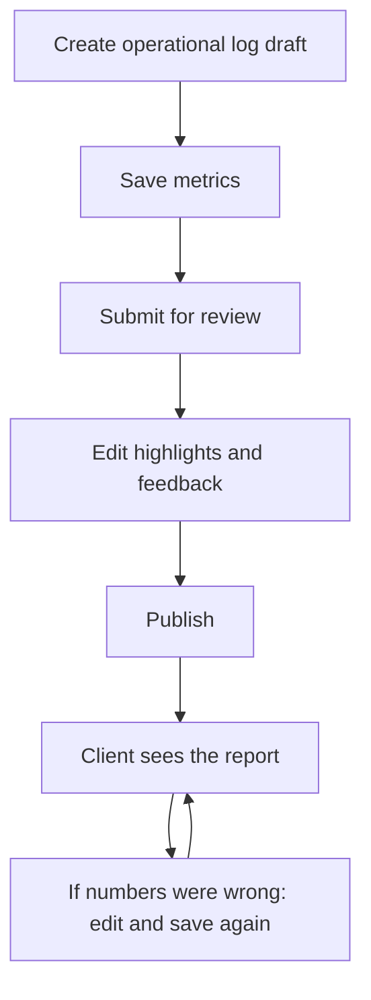

# Admin period reports & operational logs — frontend guide

This document is for the **admin dashboard** team. It explains how operational logs and client period reports work on the backend, which APIs to call, and what the UI must do — including **correcting a report after it is already published**.

Base path (Sanctum bearer token required):

```text
/v1/web/admin
```

Who can call these APIs: **admin** and **super_admin** (anyone who can already open the care-plan admin dashboard). Support users get `403`. There is no extra “amend” permission.

---

## 1. Two objects, not one

Do not treat “the period report” as a single record. The backend keeps two linked records per care plan.

| Object | Model | Who sees it | Purpose |
|--------|--------|-------------|---------|
| Operational log | `CarePlanOperationalLog` | Admin only | Internal worksheet: period dates, metrics, daily points, adherence |
| Client report | `CarePlanReportRun` | Admin + mobile client (when published) | Client-facing snapshot: highlights, feedback, publish status |

Rules:

- One care plan has **at most one** operational log.
- That log has **at most one** client report.
- You cannot create a second log or a second report for the same care plan. Edit the existing ones.

---

## 2. Statuses

### Operational log (`operational_log.status`)

| Value | Meaning | Admin can edit metrics? |
|-------|---------|-------------------------|
| `draft` | Period chosen, metrics not saved yet | Yes |
| `in_progress` | Admin is filling / adjusting metrics | Yes |
| `locked` | Report has been published. Log stays locked so the client copy stays live | **Yes** (correction in place) |

`locked` does **not** mean “read-only in the admin UI.” It only means the client-facing report is live. Saves still work. Status stays `locked`.

`is_editable` on operational log payloads is always `true`.

### Client report (`client_report.status` / `report_run.status`)

| Value | Meaning | Visible on mobile? | Admin can edit narrative/metrics? |
|-------|---------|--------------------|-----------------------------------|
| `in_review` | Submitted, waiting for publish | No | Yes |
| `published` | Live on the client app | Yes | **Yes** (correction in place, stays published) |
| `archived` | Cancelled / retired | No | **No** |

Use `is_editable` from the API:

- `true` for `in_review` and `published`
- `false` for `archived`

Do **not** hide Save just because `status === 'published'` or `operational_log.status === 'locked'`. That was the old behavior and it is now wrong.

---

## 3. Happy-path lifecycle



Normal first publish:

1. Create draft log
2. Save metrics (`draft` → `in_progress`)
3. Submit for review (creates/updates the client report as `in_review`)
4. Adjust highlights / feedback
5. Publish (`in_review` → `published`, log becomes `locked`)
6. Mobile shows the report; client may get a push

After publish, if the calculated data is wrong:

7. Open the same workspace
8. Edit metrics / nutrition actuals / feedback / highlights
9. **Save with the same PUT endpoints**
10. Report stays `published`. Do not unpublish. Do not submit-for-review again.

---

## 4. Screens and which API they use

### A. Operational logs list

```http
GET /v1/web/admin/operational-logs
```

Query: `status` (`draft` \| `in_progress` \| `locked`), `search`, `care_plan_id`, `per_page`.

Row includes `is_editable: true` and optional `client_report { id, code, status }`.

Open the care plan **report workspace** from a row. Do not build a separate editor that bypasses the workspace.

### B. Period reports list

```http
GET /v1/web/admin/period-reports
```

Query: `status` (`in_review` \| `published` \| `archived`), `search`, `care_plan_id`, `per_page`.

Default list is `in_review` + `published` (archived only when filtered).

`is_editable` is `true` unless `archived`. Published rows must still offer Edit / Open workspace.

### C. Period report detail (read)

```http
GET /v1/web/admin/period-reports/{report_run}
```

Full metrics, highlights, feedback, `is_editable`.

PDF:

```http
GET /v1/web/admin/period-reports/{report_run}/download
```

This returns **raw PDF bytes**, not JSON. Draft/in-review/archived PDFs are watermarked. Published PDFs are the client copy.

### D. Report workspace (authoring)

```http
GET /v1/web/admin/care-plans/{care_plan}/report-workspace
```

No query params. Period always comes from the care plan’s single operational log.

If no log exists yet, this returns `422`. Create a draft first, then reload.

Workspace payload includes:

- `period`
- `evidence` (client raw logs)
- `suggested_metrics`
- `report_generation_defaults.average_inputs`
- `operational_log` (includes `is_editable: true`)
- `client_report` / `report_run` (same object; `null` until submit-for-review)

Use this screen for both first-time authoring **and** post-publish correction.

---

## 5. Write APIs

All of these require `auth:sanctum` and admin/super_admin. Care plan must be `active` or `completed` (`422` otherwise).

### 5.1 Create draft log

```http
POST /v1/web/admin/care-plans/{care_plan}/operational-logs/draft
```

Optional body: `period_starts_on`, `period_ends_on` (both or neither; must sit inside the care plan dates). If omitted, the care plan start/end is used.

`201`. Status: `draft`.

A second log for the same care plan returns `422`.

### 5.2 Create log with metrics (skip empty draft)

```http
POST /v1/web/admin/care-plans/{care_plan}/operational-logs
```

`metrics` required (min 1). Same period rules as draft. Status: `in_progress`. Also `422` if a log already exists.

### 5.3 Save / correct operational metrics

```http
PUT /v1/web/admin/care-plans/{care_plan}/operational-logs/{operational_log}
```

Works for `draft`, `in_progress`, **and `locked`**.

Body (all optional except each metric must include `daily_points` when `metrics` is sent):

```json
{
  "adherence_percentage": 75,
  "metrics": [
    {
      "section": "nutrition",
      "metric_key": "meals_total_kcal",
      "label": "All Nutrition Meals",
      "target_value": 2100,
      "actual_value": 1900,
      "unit": "Kilocalorie",
      "display_order": 0,
      "daily_points": [
        {
          "day_number": 1,
          "target_value": 2100,
          "actual_value": 1900,
          "on_target": false
        }
      ]
    }
  ]
}
```

`section` must be one of: `nutrition`, `movement`, `activity`, `hydration`, `sleep`, `recovery`.

If `adherence_percentage` is omitted, the backend recalculates it from task logging.

After a published correction:

- log status stays `locked`
- `locked_at` stays
- linked client report stays `published`
- `published_at` does not change
- mobile immediately shows the new metrics (same report id)

Sending `metrics` **replaces** all metrics on the log. Always send the full metrics array, not a partial patch.

### 5.4 Nutrition actual calories (also allowed after publish)

```http
PUT /v1/web/admin/care-plans/{care_plan}/days/{day}/nutritions/{nutrition}/actual-calories
```

```json
{ "actual_value": 450 }
```

`actual_value` may be `null` to clear. If an operational log exists, the `meals_total_kcal` rollup is synced even when the log is `locked`.

### 5.5 Submit for review (first time / before publish only)

```http
POST /v1/web/admin/care-plans/{care_plan}/operational-logs/{operational_log}/submit-for-review
```

Creates the client report as `in_review`, or refreshes an existing `in_review` report (highlights are rebuilt).

Optional body: `feedback`, `average_inputs`, `included_metric_keys`, `manual_highlights`.

**Do not call this after publish.** Backend returns `422`:

`This report is already published and can no longer be regenerated.`

Corrections after publish use PUT (5.3 / 5.6), not submit-for-review.

Also `422` if the log is still `draft` (save metrics first).

### 5.6 Save highlights and feedback

```http
PUT /v1/web/admin/care-plans/{care_plan}/report-runs/{report_run}
```

Works for `in_review` **and `published`**. `422` for `archived`.

```json
{
  "feedback": {
    "summary": "Strong consistency this period.",
    "focus_next_period": "Hydration before noon.",
    "notes": "Internal only — not shown on mobile."
  },
  "highlights": [
    {
      "metric_key": "avg_intake",
      "label": "Average intake",
      "value": 1750,
      "unit": "Kilocalorie",
      "source": "manual",
      "is_visible_to_client": true,
      "display_order": 0
    }
  ]
}
```

`feedback.notes` is admin-only. Mobile never receives `notes`.

If you send `highlights`, send the **full** list. It replaces existing highlights. At least one item is required when the key is present.

Publish still requires **at least one** highlight with `is_visible_to_client: true`. Keep that true when correcting a published report as well, or the client app can show an empty highlight list.

### 5.7 Publish

```http
POST /v1/web/admin/care-plans/{care_plan}/report-runs/{report_run}/publish
```

Empty body.

Only `in_review` can be published. Already `published` → `422` (`Only client reports in review can be published.`).

Other `422` cases:

- Care plan has no `ends_on`
- Today is still before the care plan end date
- No operational log
- Zero client-visible highlights

On success: report `published`, log `locked`, client notification/push may fire. There is **no second notification** when you later correct a published report.

---

## 6. Frontend handling (important)

### Enable editing after publish

| Old UI assumption | Correct behavior now |
|-------------------|----------------------|
| Disable form when `locked` / `published` | Keep Save enabled when `is_editable === true` |
| “Published = read-only” | Published = live, but still correctable |
| Correction = unpublish then edit | Correction = PUT, stay published |
| Submit-for-review again after publish | Never; it 422s |

Suggested UI copy for a published report:

> This report is live on the client app. Saving will update the numbers the client already sees. It will not create a new report.

Optional confirm dialog on first save after publish is fine. Do not invent a new “Amend” API.

### Buttons by state

| State | Save metrics | Save narrative | Submit for review | Publish | Download PDF |
|-------|--------------|----------------|-------------------|---------|--------------|
| Log `draft` | Yes | Hidden (no report yet) | No (save metrics first) | No | No |
| Log `in_progress`, no report | Yes | Hidden | Yes | No | No |
| Report `in_review` | Yes | Yes | Yes (rebuilds highlights) | Yes (after plan end + visible highlight) | Yes (watermarked) |
| Report `published` | Yes | Yes | **No** | **No** | Yes |
| Report `archived` | No | No | No | No | Yes (watermarked) |

### Do not

- Create a second operational log when one exists — open workspace instead.
- Change period dates after the log exists unless the backend starts supporting it on PUT (current PUT does not change period; period is set at create).
- Patch a single metric; send the full `metrics` array.
- Expect `published_at` to update on correction. It is the original publish time.
- Gate this feature on `super_admin`. Admin and super_admin both can.

### After save

Reload workspace or apply the PUT response. Mobile uses the same report `id`, so deep links / notifications still work.

---

## 7. Typical error map

| HTTP | When | UI |
|------|------|----|
| `401` | Not logged in | Redirect to admin login |
| `403` | Support / non-admin | Hide these screens |
| `404` | Wrong care plan / log / report id | Toast + back to list |
| `422` `care_plan` | Plan not `active` or `completed` | Explain reporting is only for active/completed plans |
| `422` `operational_log` already exists | Second create | Open existing workspace |
| `422` log still `draft` on submit-for-review | No metrics yet | Prompt save metrics |
| `422` already published on submit-for-review | Tried to regenerate | Use PUT instead |
| `422` only in-review can publish | Publish clicked on published row | Hide Publish |
| `422` publish before plan end | Too early | Disable Publish until `ends_on` |
| `422` no visible highlights | Publish without client highlight | Require at least one visible highlight |
| `422` archived cannot be edited | Save on archived | Read-only |

Validation errors use the usual Laravel JSON `errors` object.

---

## 8. TypeScript shapes (minimum)

```ts
type OperationalLogStatus = 'draft' | 'in_progress' | 'locked';
type ClientReportStatus = 'in_review' | 'published' | 'archived';

type OperationalLog = {
  id: number;
  code: string;
  status: OperationalLogStatus;
  is_editable: true;
  adherence_percentage: number;
  period: { starts_on: string; ends_on: string | null };
  metrics: Metric[];
};

type ClientReport = {
  id: number;
  code: string;
  status: ClientReportStatus;
  is_editable: boolean; // false only when archived
  operational_log_id: number | null;
  adherence_percentage: number;
  period: { starts_on: string | null; ends_on: string | null };
  metrics: Metric[];
  highlights: Highlight[];
  feedback: {
    summary: string | null;
    focus_next_period: string | null;
    notes: string | null; // admin only
  } | null;
  timestamps: {
    submitted_for_review_at: string | null;
    published_at: string | null;
    locked_at: string | null;
  };
};
```

---

## 9. QA checklist for the admin UI

- [ ] Workspace opens for a published / locked report with Save enabled
- [ ] Changing a metric on a published report succeeds; status remains `published` / `locked`
- [ ] Client mobile history/detail shows the new numbers without a new report id
- [ ] Submit for review is hidden or disabled after publish (API would 422)
- [ ] Publish is hidden after publish
- [ ] Archived report is read-only
- [ ] Support user cannot open these screens (`403`)
- [ ] Admin (not only super admin) can correct a published report
- [ ] Nutrition actual calories still save when the log is locked
- [ ] At least one visible highlight remains after a published narrative save
- [ ] PDF download still works for published reports

---

## 10. Product note you can show internally

In-review is still the normal quality gate. Publish still freezes the report for the client.

If a published report has wrong calculated data, staff do **not** unpublish it. They correct it in the same workspace. The client keeps the same report; only the numbers change.
